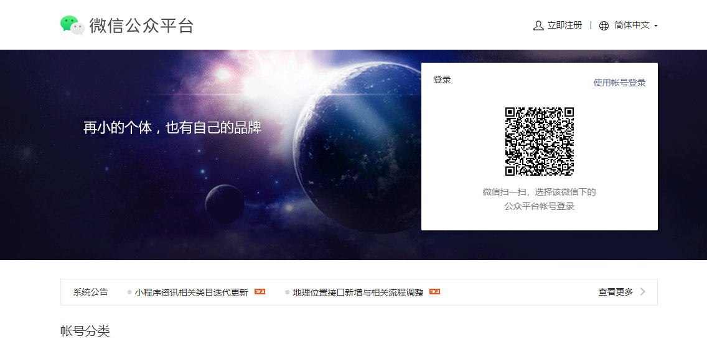
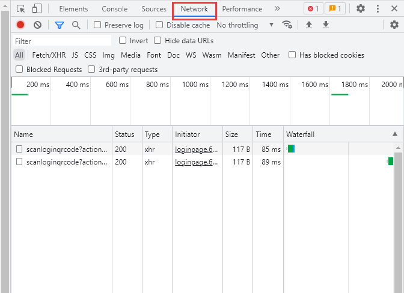
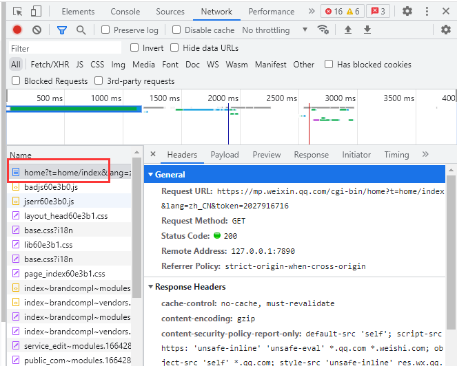
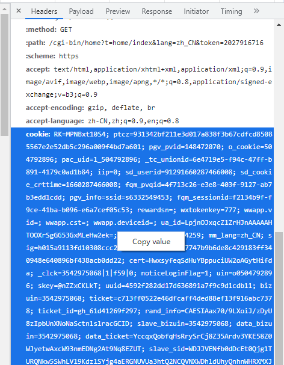
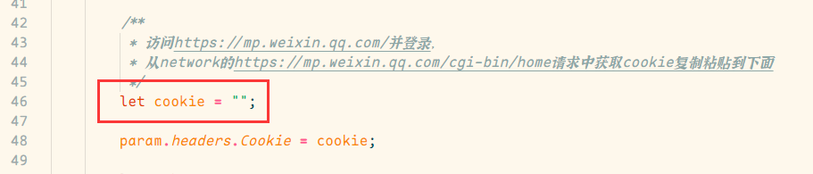

  

<h1 align="center">MuXia-js-plugin</h1>

上图来自画师[ｍｅｍｅｎｏ](https://www.pixiv.net/users/62635184)，强烈安利

此项目依赖于[YunzaiBot](https://github.com/Le-niao/Yunzai-Bot)

# 插件列表

| 插件名称|支持v2|支持v3|备注|
|-----------|-------|------|------|
|速速挨打| |✔| |
|不可以打人| |✔| |
|今日日报| |✔| |
|禁言套餐| |✔| |

## 使用指南
将js文件复制到`..\Yunzai-Bot\plugins\example`目录下，将img下的文件复制到`..\Yunzai-Bot\resources\img`目录下，没有img目录新建一个

### 今日日报cookie获取教程
1. 访问[微信公众号](https://mp.weixin.qq.com/)官网

2. 按f12打开浏览器控制台,点击Network

3. 登录微信账号
登录成功后，在network页面找到下图标注的请求，点击

4. 找到cookie选项，右键copy value

5. 粘贴到`my_plugin_get_day_news.js`插件的图示位置

## 其他
* [Yunzai-Bot](https://github.com/Le-niao/Yunzai-Bot)
* Yunzai-Bot插件库：[☞github](https://github.com/yhArcadia/Yunzai-Bot-plugins-index) [☞gitee](https://gitee.com/yhArcadia/Yunzai-Bot-plugins-index)