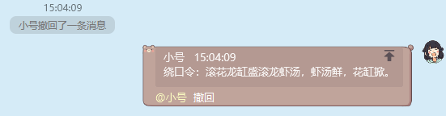
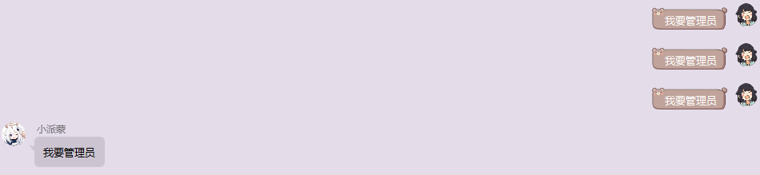

  

<h1>MuXia-js-plugin</h1>

[![](https://img.shields.io/badge/Yunzai-v3.0.0-f0f0f0?style=flat-square&logo=data:image/svg+xml;base64,PHN2ZyBjbGFzcz0iaWNvbiIgdmlld0JveD0iMCAwIDEwMjQgMTAyNCIgeG1sbnM9Imh0dHA6Ly93d3cudzMub3JnLzIwMDAvc3ZnIiB3aWR0aD0iMjAwIiBoZWlnaHQ9IjIwMCI+PHBhdGggZD0iTTUxMiA4NS4zMzNhODUuMzMzIDg1LjMzMyAwIDAgMSA4NS4zMzMgODUuMzM0YzAgMzEuNTczLTE3LjA2NiA1OS4zMDYtNDIuNjY2IDczLjgxM3Y1NC4xODdoNDIuNjY2QTI5OC42NjcgMjk4LjY2NyAwIDAgMSA4OTYgNTk3LjMzM2g0Mi42NjdBNDIuNjY3IDQyLjY2NyAwIDAgMSA5ODEuMzMzIDY0MHYxMjhhNDIuNjY3IDQyLjY2NyAwIDAgMS00Mi42NjYgNDIuNjY3SDg5NnY0Mi42NjZhODUuMzMzIDg1LjMzMyAwIDAgMS04NS4zMzMgODUuMzM0SDIxMy4zMzNBODUuMzMzIDg1LjMzMyAwIDAgMSAxMjggODUzLjMzM3YtNDIuNjY2SDg1LjMzM0E0Mi42NjcgNDIuNjY3IDAgMCAxIDQyLjY2NyA3NjhWNjQwYTQyLjY2NyA0Mi42NjcgMCAwIDEgNDIuNjY2LTQyLjY2N0gxMjhhMjk4LjY2NyAyOTguNjY3IDAgMCAxIDI5OC42NjctMjk4LjY2Nmg0Mi42NjZWMjQ0LjQ4Yy0yNS42LTE0LjUwNy00Mi42NjYtNDIuMjQtNDIuNjY2LTczLjgxM0E4NS4zMzMgODUuMzMzIDAgMCAxIDUxMiA4NS4zMzNNMzIwIDU1NC42NjdhMTA2LjY2NyAxMDYuNjY3IDAgMCAwLTEwNi42NjcgMTA2LjY2NkExMDYuNjY3IDEwNi42NjcgMCAwIDAgMzIwIDc2OGExMDYuNjY3IDEwNi42NjcgMCAwIDAgMTA2LjY2Ny0xMDYuNjY3QTEwNi42NjcgMTA2LjY2NyAwIDAgMCAzMjAgNTU0LjY2N20zODQgMGExMDYuNjY3IDEwNi42NjcgMCAwIDAtMTA2LjY2NyAxMDYuNjY2QTEwNi42NjcgMTA2LjY2NyAwIDAgMCA3MDQgNzY4YTEwNi42NjcgMTA2LjY2NyAwIDAgMCAxMDYuNjY3LTEwNi42NjdBMTA2LjY2NyAxMDYuNjY3IDAgMCAwIDcwNCA1NTQuNjY3eiIgZmlsbD0iI2ZmZiIvPjwvc3ZnPg==)](https://github.com/Le-niao/Yunzai-Bot) [![](https://img.shields.io/badge/%E7%BE%A4%E5%8F%B7-374900636-bce4e3?style=flat-square&logo=data:image/svg+xml;base64,PD94bWwgdmVyc2lvbj0iMS4wIiBzdGFuZGFsb25lPSJubyI/PjwhRE9DVFlQRSBzdmcgUFVCTElDICItLy9XM0MvL0RURCBTVkcgMS4xLy9FTiIgImh0dHA6Ly93d3cudzMub3JnL0dyYXBoaWNzL1NWRy8xLjEvRFREL3N2ZzExLmR0ZCI+PHN2ZyB0PSIxNjY1MzY4Mjk4NTkzIiBjbGFzcz0iaWNvbiIgdmlld0JveD0iMCAwIDEwMjQgMTAyNCIgdmVyc2lvbj0iMS4xIiB4bWxucz0iaHR0cDovL3d3dy53My5vcmcvMjAwMC9zdmciIHAtaWQ9IjEzNzA5IiB4bWxuczp4bGluaz0iaHR0cDovL3d3dy53My5vcmcvMTk5OS94bGluayIgd2lkdGg9IjIwMCIgaGVpZ2h0PSIyMDAiPjxwYXRoIGQ9Ik04MjQuOCA2MTMuMmMtMTYtNTEuNC0zNC40LTk0LjYtNjIuNy0xNjUuM0M3NjYuNSAyNjIuMiA2ODkuMyAxMTIgNTExLjUgMTEyIDMzMS43IDExMiAyNTYuMiAyNjUuMiAyNjEgNDQ3LjljLTI4LjQgNzAuOC00Ni43IDExMy43LTYyLjcgMTY1LjMtMzQgMTA5LjUtMjMgMTU0LjgtMTQuNiAxNTUuOCAxOCAyLjIgNzAuMS04Mi40IDcwLjEtODIuNCAwIDQ5IDI1LjIgMTEyLjkgNzkuOCAxNTktMjYuNCA4LjEtODUuNyAyOS45LTcxLjYgNTMuOCAxMS40IDE5LjMgMTk2LjIgMTIuMyAyNDkuNSA2LjMgNTMuMyA2IDIzOC4xIDEzIDI0OS41LTYuMyAxNC4xLTIzLjgtNDUuMy00NS43LTcxLjYtNTMuOCA1NC42LTQ2LjIgNzkuOC0xMTAuMSA3OS44LTE1OSAwIDAgNTIuMSA4NC42IDcwLjEgODIuNCA4LjUtMS4xIDE5LjUtNDYuNC0xNC41LTE1NS44eiIgcC1pZD0iMTM3MTAiIGZpbGw9IiNmZmZmZmYiPjwvcGF0aD48L3N2Zz4=)](https://jq.qq.com/?_wv=1027&k=ygij7e1m) [![](https://img.shields.io/github/stars/MuXia-0326/YunzaiBotJsPluginMuXia?color=bf6e6b&logo=data%3Aimage%2Fsvg%2Bxml%3Bbase64%2CPD94bWwgdmVyc2lvbj0iMS4wIiBzdGFuZGFsb25lPSJubyI%2FPjwhRE9DVFlQRSBzdmcgUFVCTElDICItLy9XM0MvL0RURCBTVkcgMS4xLy9FTiIgImh0dHA6Ly93d3cudzMub3JnL0dyYXBoaWNzL1NWRy8xLjEvRFREL3N2ZzExLmR0ZCI%2BPHN2ZyB0PSIxNjY1MzY5MDIzNzI2IiBjbGFzcz0iaWNvbiIgdmlld0JveD0iMCAwIDEwMjQgMTAyNCIgdmVyc2lvbj0iMS4xIiB4bWxucz0iaHR0cDovL3d3dy53My5vcmcvMjAwMC9zdmciIHAtaWQ9IjE0NjYzIiB4bWxuczp4bGluaz0iaHR0cDovL3d3dy53My5vcmcvMTk5OS94bGluayIgd2lkdGg9IjIwMCIgaGVpZ2h0PSIyMDAiPjxwYXRoIGQ9Ik0yODQuNDU4NjY3IDk0MS4zOTczMzNjLTM2LjQzNzMzMyAxNS42MzczMzMtNjguNDgtNy42OC02NC44OTYtNDcuMTY4bDIyLjYxMzMzMy0yNDguOTE3MzMzLTE2NC4zOTQ2NjctMTg4LjA1MzMzM2MtMjYuMDY5MzMzLTI5LjgyNC0xMy42NTMzMzMtNjcuNTYyNjY3IDI0Ljc4OTMzNC03Ni4zMDkzMzRsMjQzLjM3MDY2Ni01NS4zODEzMzMgMTI3Ljc4NjY2Ny0yMTQuNjc3MzMzYzIwLjI4OC0zNC4wOTA2NjcgNTkuOTQ2NjY3LTM0LjA2OTMzMyA4MC4yMTMzMzMgMGwxMjcuNzg2NjY3IDIxNC42NzczMzMgMjQzLjM3MDY2NyA1NS4zODEzMzNjMzguNjU2IDguNzg5MzMzIDUwLjg1ODY2NyA0Ni40ODUzMzMgMjQuNzg5MzMzIDc2LjMwOTMzNGwtMTY0LjM5NDY2NyAxODguMDUzMzMzIDIyLjc0MTMzNCAyNDkuMDAyNjY3YzMuNjA1MzMzIDM5LjUwOTMzMy0yOC40NTg2NjcgNjIuODA1MzMzLTY0Ljg5NiA0Ny4xNDY2NjZsLTIyOS41MDQtOTguNTE3MzMzLTIyOS4zNzYgOTguNDUzMzMzeiIgZmlsbD0iI2ZmZmZmZiIgcC1pZD0iMTQ2NjQiPjwvcGF0aD48L3N2Zz4%3D&style=flat-square)](https://github.com/MuXia-0326/YunzaiBotJsPluginMuXia)

访问人数

### 如果觉得本项目好用，点一个 star 吧

logo 来自画师[ｍｅｍｅｎｏ](https://www.pixiv.net/users/62635184)，强烈安利

# 插件列表

| 插件名称       | 支持 v2 | 支持 v3 | 备注 |
| -------------- | ------- | ------- | ---- |
| 今日日报       |         | ✔       |      |
| 撤回机器人消息 |         | ✔       |      |
| 热搜榜         |         | ✔       |      |
| 自动复读       |         | ✔       |      |
| 速速挨打       |         | ✔       |      |
| 不可以打人     |         | ✔       |      |
| 禁言套餐       |         | ✔       |      |

## 使用指南

将 js 文件复制到`..\Yunzai-Bot\plugins\example`目录下，将 img 下的文件复制到`..\Yunzai-Bot\resources\img`目录下，没有 img 目录新建一个

### 撤回机器人消息

回复 Bot 的消息，并携带撤回，即可

### 热搜榜

### 自动复读

根据群内发送的**单文字**或者**单表情**进行跟随复读操作,阈值为 3，可自行更改

### 今日日报 cookie 获取教程

1. 访问[微信公众号](https://mp.weixin.qq.com/)官网

    

2. 按 f12 打开浏览器控制台,点击 Network

    

3. 登录微信账号
   登录成功后，在 network 页面找到下图标注的请求，点击

    

4. 找到 cookie 选项，右键 copy value

    

5. 粘贴到`my_plugin_get_day_news.js`插件的图示位置

    

## 更新日志

-   2022-10-08 今日日报添加定时触发，优化部分提示异常，新增**撤回机器人消息**插件
-   2022-10-09 新增**热搜榜**和**自动复读**插件

##免责声明

1. 功能仅限内部交流与小范围使用，请勿将 Yunzai-Bot 及本项目用于任何以盈利为目的的场景.
2. 图片与其他素材均来自于网络，仅供交流学习使用，如有侵权请联系，会立即删除.

## 其他

-   群号：374900636
-   [Yunzai-Bot](https://github.com/Le-niao/Yunzai-Bot)
-   Yunzai-Bot 插件库：[☞github](https://github.com/yhArcadia/Yunzai-Bot-plugins-index) [☞gitee](https://gitee.com/yhArcadia/Yunzai-Bot-plugins-index)
