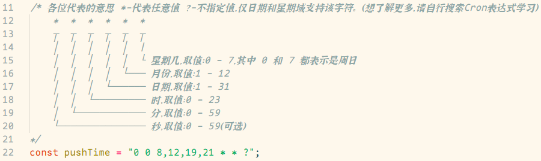
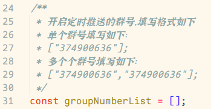
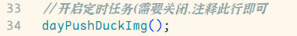
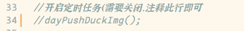

# 鸭鸭照使用帮助文档

## 使用方法

使用 **哎鸭** / **哎呀** / **aiya** 主动触发，支持主动进行 **早上好/中午好/晚上好/晚安鸭** 问好

如果需要使用问好功能，需要进行配置操作，参考下发的配置指南

## 配置指南

#### 重要提示

**以下所有操作都是在，打开项目里面的 `muxia_duck_img.js` 文件前提下进行操作的**

-   下图为修改定时任务的触发时间的代码

    

-   下图为设置定时任务推送群号的代码

    

*   下图为定时任务的开关

    开启状态

    

    关闭状态

    
