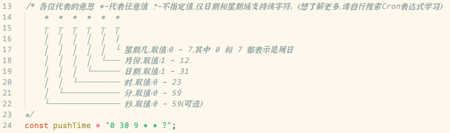
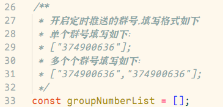
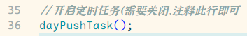
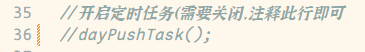
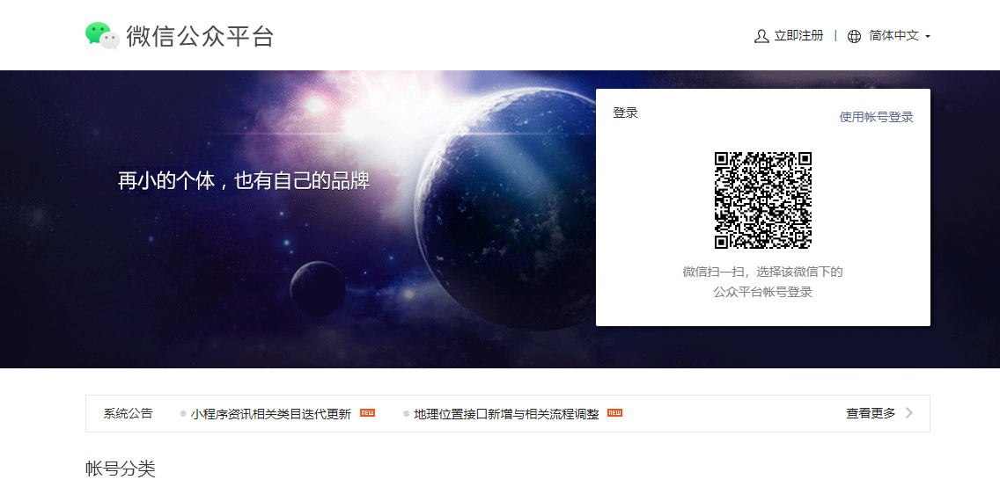
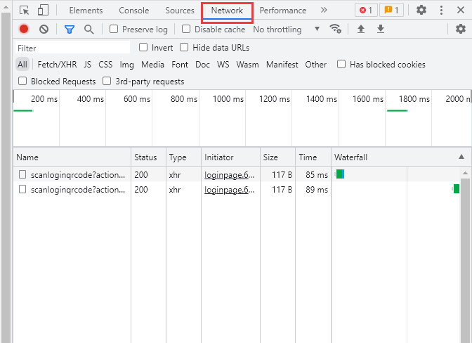
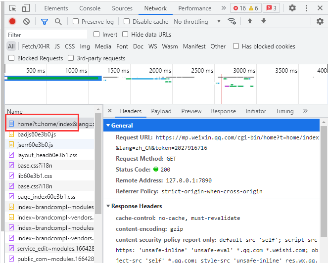
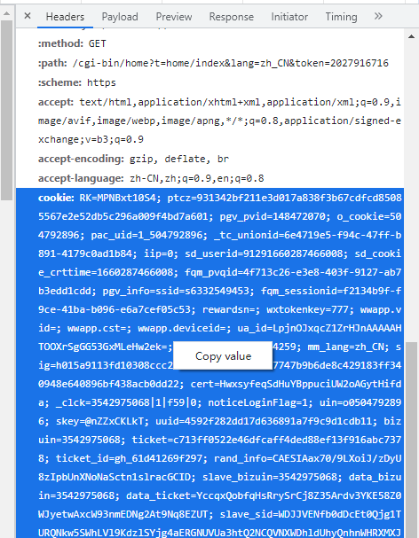
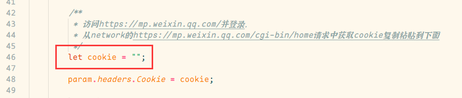

# 今日日报使用帮助文档

## 使用方法

使用 **今日日报** 主动触发

可配置定时触发，配置方法参考下面的配置指南

## 配置指南

#### 重要提示

**以下所有操作都是在，打开项目里面的 `muxia_get_day_news.js` 文件前提下进行操作的**

-   下图为修改定时任务的触发时间的代码

    

-   下图为设置定时任务推送群号的代码

    

*   下图为定时任务的开关

    开启状态

    

    关闭状态

    

### cookie 配置教程

#### 经过测试，cookie 的过期时间大致为三天，目前没找到更好的方法延长 cookie 时间，如果有好方法，请联系我

1. 访问[微信公众号](https://mp.weixin.qq.com/)官网

    

2. 按 f12 打开浏览器控制台,点击 Network

    

3. 登录微信账号
   登录成功后，在 network 页面找到下图标注的请求，点击

    

4. 找到 cookie 选项，右键 copy value

    

5. 粘贴到`my_plugin_get_day_news.js`插件的图示位置

    
