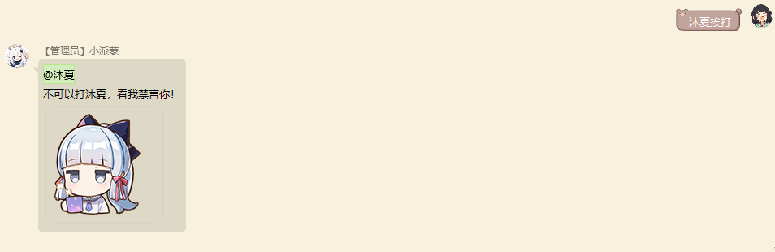
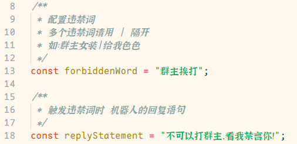

# 禁言套餐使用帮助文档

## 使用方法

自行配置违禁词，触发违禁词进行禁言操作，并撤回违禁发言（撤回违禁发言需要管理员/群主权限）

> 演示图片由于我是群主，所以禁言和撤回消息都没权利（代码是实现了对应操作的）

自行配置违禁词教程如下

## 配置指南

#### 重要提示

**以下所有操作都是在，打开项目里面的 `muxia_mute_commdity.js` 文件前提下进行操作的**

## 注意事项

**因为本插件需要用到项目 img 目录下的图片进行信息发送，所以是本本插件，就必须将 img 下的文件放到指定位置**
