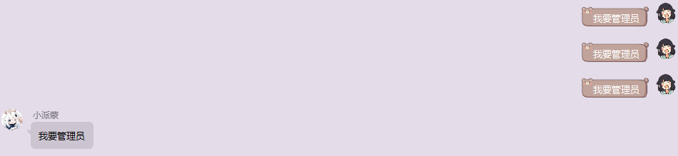
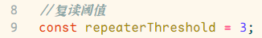

# 自动复读使用帮助文档

## 使用方法

根据群友发言随机复读

## 配置指南

#### 重要提示

**以下所有操作都是在，打开项目里面的 `muxia_repeater.js` 文件前提下进行操作的**

-   下图为修改复读阈值的代码

    

    复读阈值:即重复内容出现多少次，机器人就会触发复读操作

    上图的复读阈值代表的意思是，重复内容出现三次，机器人就会自动复读一次

    ps：机器人没办法检测高频发言
